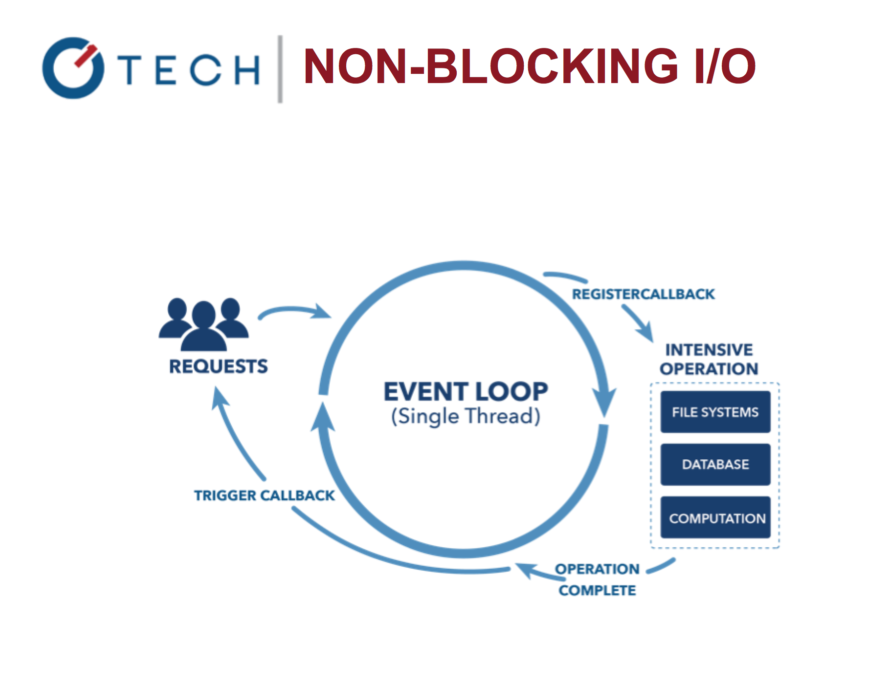
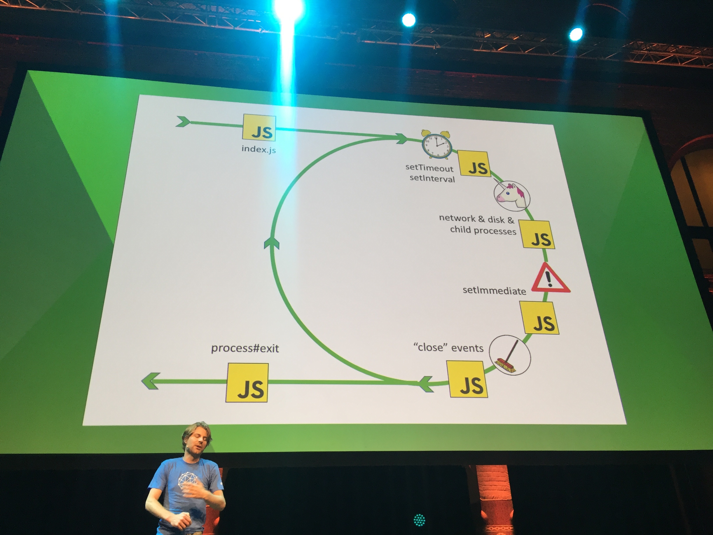
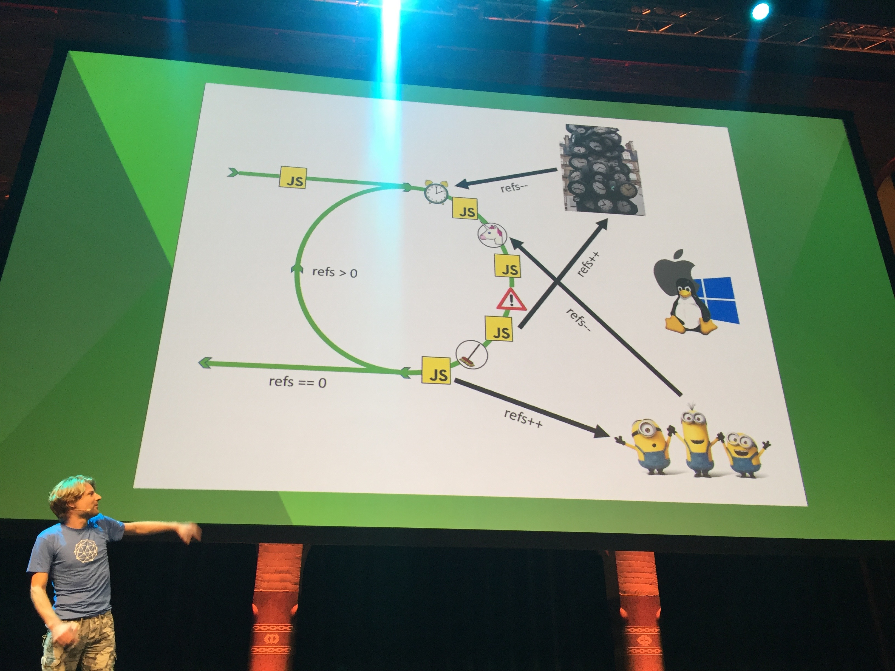
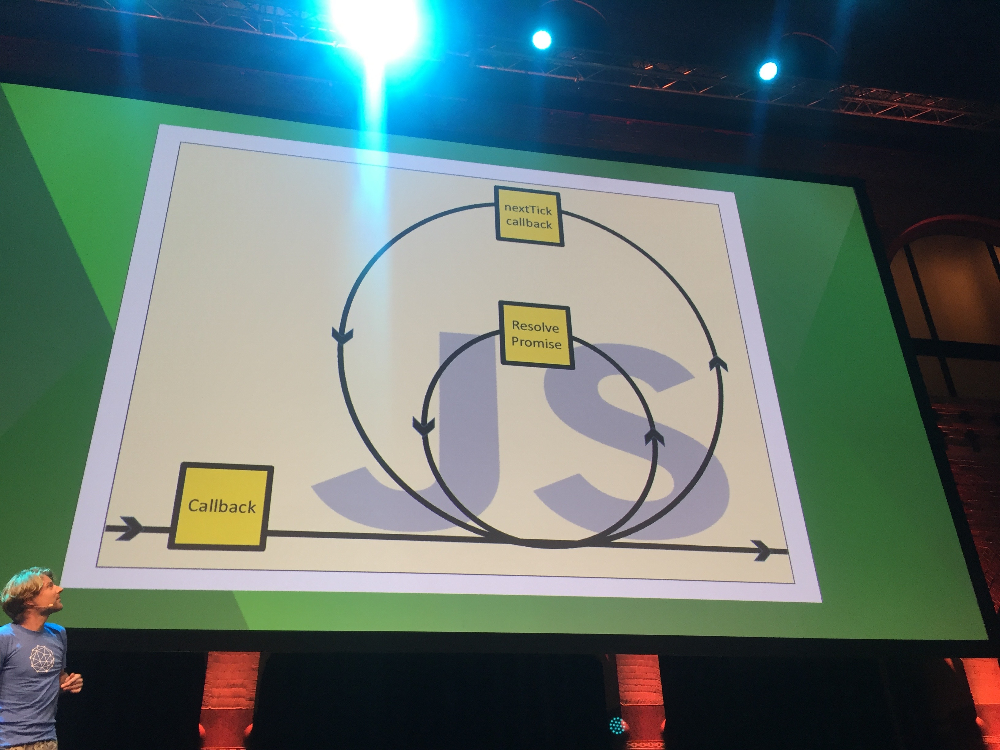
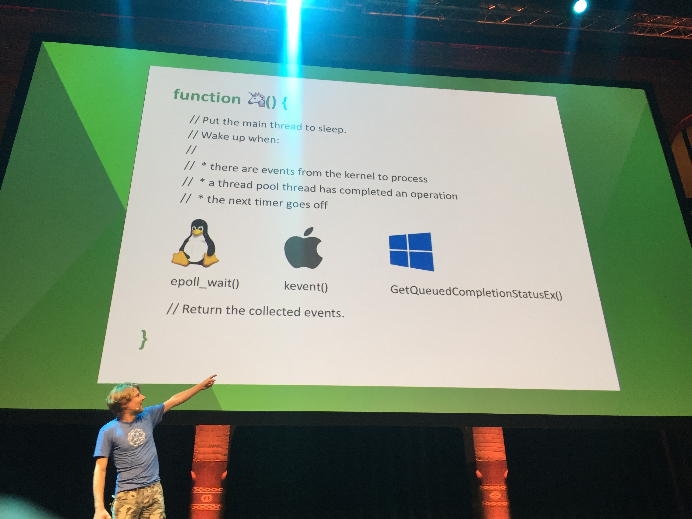
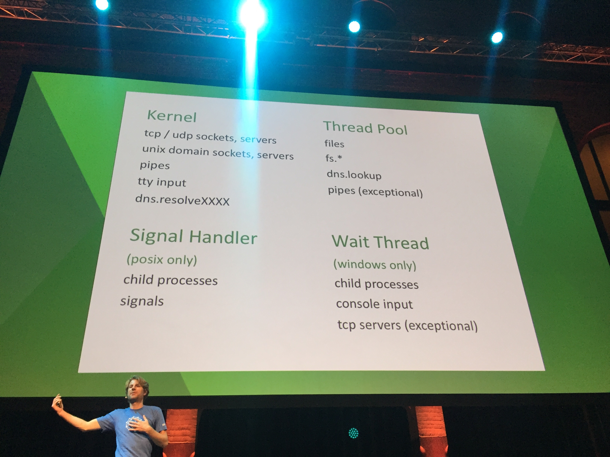
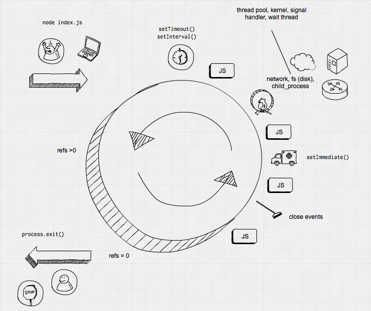

# How Node Event Loop REALLY Works: Or Why Most of the Event Loop Diagrams are WRONG

When [Bert Belder](https://twitter.com/piscisaureus) (one of the early Node core contributors) presented his keynote at Node Interactive Europe 2016 on Event Loop, he started by saying that most of event loops diagrams are WRONG. I'm guilty of using one of them in my talks. :) This is it. In it, event loop is spinning data back at clients like hot-cakes.

His diagram is closer to the real stuff. In it, event loop starts, works and then quits eventually (pun intended).

So there are a few important steps:

1. You launch a script: `node index.js`
2. `setTimeout()` and `setInterval()` kick in
3. You have some code running
4. Unicorn function (more on it later)
5. More code
6. `setImmediate()` which is not really immediate
7. Code
8. Clean up with close events
9. Last code
10. process exit if no `refs` or back to 2 if you have `refs`

Refs is a simple counter which increment when there's a async callback to be executed and decrements when it's finally executed. When working with stream callbacks (like on data), there's only one reference increment.

Each of the JS code blocks have its own `process.nextTick()`:

Yes. `nextTick()` should really be immediate and `setImmediate()` should be next tick. Argh. Just remember them as opposites. In other words, if all you have is bunch of `nextTick()` callbacks, your code will be run in that JS block and never go to the next event loop cycle (steps 2-9).

Finally, there's the unicorn function. It's like a communicator between Node and OS. You see, OS and its processes are async but they look like synchronous. This unicorn taps into the async nature and leverages it for Node's event loop. Plus, unicorns are cool:

By the way, despite what diagrams are depicting, thread pool is not making network requests or performing sockets TCP work. The latter happens in Kernel. 

Table flip? Exactly. But the nice thing about Node is for most of the things like building an Express server or running a Gulp task, you don't need to know how event loop actually works!

Many thanks to Bert. This was one of my favorite talks at Node Interactive EU 2016. Now I'm going to re-draw my diagram to more appropriately illustrate how event loop really works in Node. :) How about this one?

