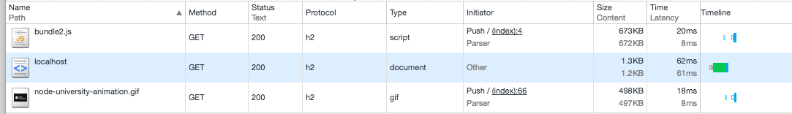
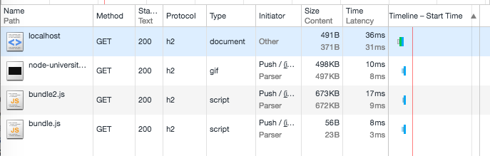
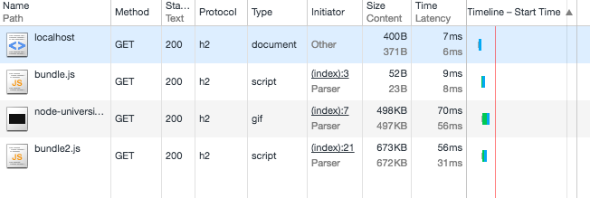

# Implementing Express Middleware to do HTTP/2 Server Push

In the previous post, we learned how to perform HTTP/2 server push in a Node server.  We also covered the benefits of server push there so to avoid duplication we won't list them here. We used `spdy` for server push and H2. But most of the times Node developers don't work with core HTTP server, they use a framework like Express. So let's see how we can implement server push in Express.

To illustrate pushing with Express, we'll implement an Express middleware which will push any images or scripts to the browser. The middleware will use a hash map of dependencies so to say. For example, `index.html` will have `bundle.js`, `node-university-animation.gif` image and one more script `bundle2.js`.

You can even use this middleware to serve images. The regular expression will work without modifications because both `<script>` and `` tags use src attribute. This is how pushing an image (of [Node.University](http://node.university) animation) will look like:


As you can see, with the image there's also no green bar (Waiting TTFB).




Note: This middleware is not intended for production use. It's purpose is to illustrate what is possible in the HTTP/2 protocol and Node+Express.

# Project Structure

The code for the project is in [GitHub](https://github.com/azat-co/http2-node-server-push), and the project structure is a typical Express server with a static folder:

```
/node_modules
/public
  - bundle.js
  - bundle2.js
  - index.html
  - node-university-animation.gif
- index-advanced.js
- package.json
- server.crt
- server.csr
- server.key
```

I didn't commit SSL keys for obvious reason (neither should you in your projects!), so please generate your own. HTTP/2 won't work without SSL/HTTPS. You can get the instruction in [HTTP/2 with Express](http://webapplog.com/http2-node).

# Installing Dependencies

Firstly, declare dependencies in your `package.json` with these npm deps:

```
{
  "name": "http2-node-server-push",
  "version": "1.0.0",
  "description": "",
  "main": "index.js",
  "scripts": {
    "test": "echo \"Error: no test specified\" && exit 1",
    "start": "./node_modules/.bin/node-dev .",
    "start-advanced": "./node_modules/.bin/node-dev index-advanced.js"
  },
  "keywords": [
    "node.js",
    "http2"
  ],
  "author": "Azat Mardan",
  "license": "MIT",
  "dependencies": {
    "express": "^4.14.0",
    "morgan": "^1.7.0",
    "spdy": "^3.4.0"
  },
  "devDependencies": {
    "node-dev": "^3.1.3"
  }
}
```

Feel free to copy `package.json` and run `npm i`.

# HTML File

The `index.html` has three assets:

```html
<html>
<body>
  <script src="bundle.js"/></script>

  <h1>hello to http2 push server!</h1>
  <div></div>

  
  <div></div>
  <div></div>
  <div></div>
  <div></div>
  <div></div>
  <div></div>
  <div></div>
  <div></div>
  <div></div>
  <div></div>
  <div></div>
  <div></div>
</body>
  <script src="bundle2.js"/></script>
</html>
```

`bundle.js` is very small:

```js
console.log('bundle1')
```

On the other hand, `bundle2.js` is rather large (it has React core).

# Defining Express Server

Let's take a look at the implementation which is in the `index-advanced.js`. In the beginning, we define the dependencies such as Express itself and a few other modules. The `pushOps` object will be used later for

```js
var express = require('express')
var app = express()
const fs = require('fs')
const path = require('path')
const url = require('url')
```

Now, let's read and map all the script and image includes in all the files using this algorithm. It will run just once when you start the server, thus it won't take up the time during requests. It's okay to use a `readFileSync` because we are not running the server yet.

```js
let files = {}
fs.readdir('public', (error, data)=>{
  data.forEach(name=>{
    files[`${name}`]=fs
      .readFileSync(path.join(__dirname, 'public', `${name}`), {encoding: 'utf8'})
      .split('\n')
      .filter(line=>line.match(/src *?= *?"(.*)"/)!=null)
      .map(line=>line.match(/src *?= *?"(.*)"/)[1])
  })
})
```

The functions inside of the `filter` and `map` will use Regular Expression to produce this object:

```
{ 'bundle.js': [],
  'bundle2.js': [],
  'index.html': [ 'bundle.js', 'node-university-animation.gif', 'bundle2.js' ],
  'node-university-animation.gif': [] }
```

By using `index.html` as a key of this object, we'll be able to quickly access array of its dependencies. An empty array means there's no deps which we can server push.


Next, define logger middleware to keep track of requests on the server side:

```js
const logger = require('morgan')
app.use(logger('dev'))
```

# Implementing Server Push Middleware

So we got the object which has information about what to push. To actually push assets, create a middleware like this in which we strip the `/` and default to `index.html` when there's no path in the URL (like for `https://localhost:8080/` the `urlName` will become `index.html`):

```js
app.use((request, response, next)=>{
  let urlName = url.parse(request.url).pathname.substr(1)
  if (urlName === '' || urlName === '/') urlName = 'index.html'
  console.log('Request for: ', urlName)
```

Of course, let's check if we even have this file in our `public` folder by matching the name as a key of the `files` object. If true, then go ahead and create `assets` to store code for server push. Each `assets` array item will be an asset like a script or an image.

```js
  if (files[urlName]) {
    let assets = files[urlName]
      .filter(name=>(name.substr(0,4)!='http'))
      .map((fileToPush)=>{
        let fileToPushPath = path.join(__dirname, 'public', fileToPush)
        return (cb)=>{
          fs.readFile(fileToPushPath, (error, data)=>{
            if (error) return cb(error)
            console.log('Will push: ', fileToPush, fileToPushPath)
            try {
              response.push(`/${fileToPush}`, {}).end(data)
              cb()
            } catch(e) {
              cb(e)
            }
          })
        }
      })
```

The actual push is happening in `response.push(`/${fileToPush}`, {}).end(data)`. You ca n improve this call by passing content type instead of the empty object `{}`. Also, it's possible to use stream and not a buffer `data` of `readFile`.

Next, let's add the `index.html` itself (or whatever the file name is):

```js
    // Uncomment to disable server push
    // assets = []
    console.log('Total number of assets to push: ', assets.length)
    assets.unshift((cb)=>{
      fs.readFile(path.join(__dirname, 'public', urlName), (error, data)=>{
        if (error) return cb(error)
        response.write(data)
        cb()
      })
    })
```

Now, we can send all the assets and HMTL in one go:

```js
    require('neo-async').parallel(assets, (results)=>{
      response.end()
    })
  } else {
    return next()
  }
})
```


# Launching HTTP/2 Server

Finally, launch the H2 server using keys, cert and `spdy`:

```js
var options = {
  key: fs.readFileSync('./server.key'),
  cert: fs.readFileSync('./server.crt')
}

require('spdy')
  .createServer(options, app)
  .listen(8080, ()=>{
    console.log(`Server is listening on https://localhost:8080.
You can open the URL in the browser.`)
  }
)
```


When you'll start the server with `npm run start-advanced`, then you will see this prompt:

```
Server is listening on https://localhost:8080.
You can open the URL in the browser.
```

Just remember to use https and not http. While by the HTTP/2 standard, it's possible to use unencrypted http protocol, most of the browsers decided to support only https for obvious security reasons.


When making a request to the home page, server will send `index.html`. As you can see from the logs, there's only one request when using server push.

```
Request for:  index.html
Total number of assets to push:  13
Will push:  bundle.js /Users/azat/Documents/Code/http2-node-server-push/public/bundle.js
Will push:  node-university-animation.gif /Users/azat/Documents/Code/http2-node-server-push/public/node-university-animation.gif
Will push:  bundle2.js /Users/azat/Documents/Code/http2-node-server-push/public/bundle2.js
```

We are done with our server and middleware. Start the server and see results at <https://localhost:8080/>. They might vary...

# Summary


Actual benefits of a server push depend on many factors such as caching, order of assets, size and complexity of rendering HTML. I didn't got much of a boost in my `index.html`, but the "Waiting TTFB" is gone on H2 pushes.

You can play around by uncommenting `assets = []` which is basically removes assets push code. What's interesting is that I got start time (Network tab in DevTools) of the assets faster than other with H2 server push



While without push the start order will ALWAY be the same as in `HTML`, i.e., `bundle.js`, `node-university-animation.gif` and `bundle2.js`.





Server push is extremely powerful but should be used knowingly to avoid any conflict or sending assets which are already in cache. The results depend on many factors. You can use this middleware for educational purposes. If you liked this article,