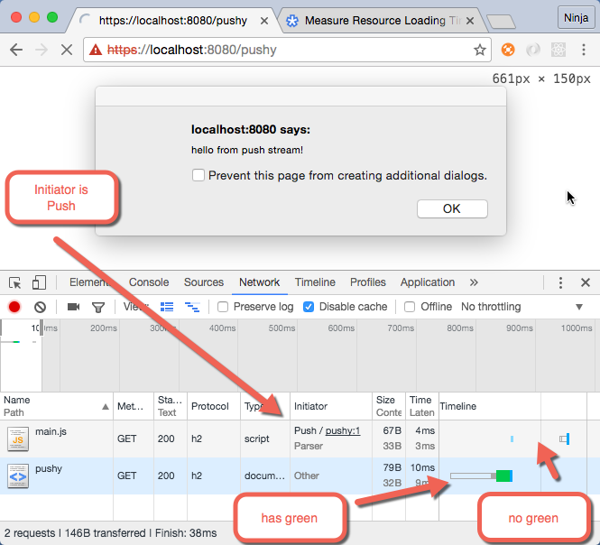

# HTTP/2 Server Push with Node and Express

HTTP/2 is the new standard of the web. It has many great features which will make the web faster and simplify the development. For example, no need to concatenate files thanks to multiplexing, or a server push which can send files before a browser knows it need them. 

This post won't cover all advantages of HTTP/2. You can read about them online. No need to go into all the details and duplicate text here. Instead, we'll focus on server push and implement it in Node.js using Express and the [`spdy`](https://github.com/indutny/node-spdy) library. 

## Server Push—Yeah!

The way server push works is by bundling multiple assets and resources into a single HTTP/2 call. Under the hood, server will issue a PUSH_PROMISE. Clients (browsers included) can use it or not depending on if the main HTML file needs it. If yes, it needs it, then client will match received push promises to make them look like a regular HTTP/2 GET calls. Obviously, if there's a match, then no new calls will be made, but the assets already at the client will be used. Some good articles for more info on server push benefits.

* [What’s the benefit of Server Push?](https://http2.github.io/faq/#whats-the-benefit-of-server-push)
* [Announcing Support for HTTP/2 Server Push](https://blog.cloudflare.com/announcing-support-for-http-2-server-push-2)
* [Innovating with HTTP 2.0 Server Push](chttps://www.igvita.com/2013/06/12/innovating-with-http-2.0-server-push)

This is a practical article which focuses on implementing HTTP/2 server push in Node. To be more precise, we'll implement a Node and Express server with a single route `/pushy` which pushes a JavaScript file. As mentioned earlier, we'll use the `spdy` library.

## HTTP/2 and Node.js

A few words on the choice of the `spdy` library for Node: as of right now, there are two main implementations of HTTP/2 for Node.js: 

* [`http2`](https://github.com/molnarg/node-http2)
* [`spdy`](https://github.com/indutny/node-spdy)

Both of them are very similar to the core `http` and `https` modules meaning if you don't use Express, there's very little difference. However, the `spdy` library supports HTTP/2 and Express while [the `http2` library is not supporting Express at this moment](https://github.com/molnarg/node-http2/issues/100). This is a solid reason to use `spdy` because let's face it, Express is the de facto standard framework for Node web apps. That's the reason, I picked `spdy`. The name `spdy` is from the Google SPDY protocol which is evolved into HTTP/2. 

## HTTPS Keys and Certs

First of all, you'll need to generate key and cert to be able to use HTTPS encryption, because that's the only way HTTP/2 will work in your browsers (Firefox, Safari, Chrome, or Edge). Go ahead and search for "ssl key generation" or follow steps below (because I won't commit my key and cert to [the GitHub repo](https://github.com/azat-co/http2-node-server-push) for this project):

```js
$ mkdir http2-node-server-push 
$ cd http2-node-server-push
$ openssl genrsa -des3 -passout pass:x -out server.pass.key 2048
```

Then run this:

```
$ openssl rsa -passin pass:x -in server.pass.key -out server.key
```

Observe:

```
writing RSA key
```


Get rid of RSA:

```
$ rm server.pass.key
$ openssl req -new -key server.key -out server.csr
```

Answer questions:

```
Country Name (2 letter code) [AU]:US
State or Province Name (full name) [Some-State]:California
A challenge password []:
...
```

Finally run:

```
$ openssl x509 -req -sha256 -days 365 -in server.csr -signkey server.key -out server.crt
```

At the end, you should have three SSL files:

* `server.crt`
* `server.csr`
* `server.key`

You'll be reading from `server.key` and `server.crt` in your Node.js server script.

## Project Structure

Now is a good time to create a `package.json` file and install dependencies:

```
npm init -y
npm i express@4.14.0 morgan@1.7.0 spdy@3.4.0 --save
npm i node-dev@3.1.1 --save-dev
```

 and the project folder will look:
 
 ```
 /http2-node-server-push
   /node_modules
  - index.js
  - package.json
  - server.crt
  - server.csr
  - server.key
 ```
 
Feel free to add these two npm scripts into `scripts` of `package.json` to simplify launch commands (which use node-dev for auto-reloading):
 
```js
    "start": "./node_modules/.bin/node-dev .",
    "start-advanced": "./node_modules/.bin/node-dev index-advanced.js"
```

Now we are ready to implement a simple server push using Node, Express and spdy.

## Implementing a Server Push HTTP/2 Server with Node.js and Express.js

Firstly, import the dependencies. Create `index.js` in the same folder as `package.json` (see project structure above). 


I'm using fancy new ES6/ES2015 syntax of `const` to declare my modules. If you are not familiar with this type of declarations, see
[*Top 10 ES6 Features Every Busy JavaScript Developer Must Know*](http://webapplog.com/es6).

```js
const http2 = require('spdy')
const logger = require('morgan')
const express = require('express')
const app = express()
const fs = require('fs')
```

Next, we'll apply morgan logger to see what requests are server by the server:

```js
app.use(logger('dev'))
```

Now, there's a home page on which we tell to go to `/pushy` which will be our server push page.

```
app.get('/', function (req, res) {
  res.send(`hello, http2!
go to /pushy`)
})
```


The server push is implemented by easily using `res.push` which is coming from spdy. We pass the file name which browser will use to match push promise with the asset. Hence, the `/main.js` in `res.push()` must match what you'll request in HTML. 

The second argument is an object. It's is optional and sets the pushed asset information:

```
app.get('/pushy', (req, res) => {
  var stream = res.push('/main.js', {
    status: 200, // optional
    method: 'GET', // optional
    request: {
      accept: '*/*'
    },
    response: {
      'content-type': 'application/javascript'
    }
  })
  stream.on('error', function() {
  })
  stream.end('alert("hello from push stream!");')
  res.end('<script src="/main.js"></script>')
})
```


As you can observe, `stream` has methods `on` and `end`. The former will allow to listen to events with as `error` or `finish`. The latter is when we are done. The `main.js` script will show an alert box (webdev circa 1990). 

Alternatively, you can use `res.write()` and then `res.end()` in the end if you have multiple data chunks, because `end()` will automatically close the response while `write` keep it open. (This approach is not shown in the current implementation.)

Lastly, let's spin up the server by first loading the SSL data such as key and cert, and then using spdy (the `http2` var) to boot up the server.

```js
var options = {
  key: fs.readFileSync('./server.key'),
  cert: fs.readFileSync('./server.crt')
}

http2
  .createServer(options, app)
  .listen(8080, ()=>{
    console.log(`Server is listening on https://localhost:8080.
You can open the URL in the browser.`)
  }
)
```

The gist of this implementation: it's all about streams. Not the one you might find in the woods, but the once developers use to pipe the data from source to destination. If you know nothing about stream or that http request and response in Node and Express are stream, check out [*You Don't Know Node*](https://github.com/azat-co/you-dont-know-node#streams).


## Running and Diffing HTTP/2 Server Push

Run this with `node index.js` or `npm stat`. Go to the <https://localhost:3000/pushy> and see the alert box. Boom! We didn't even have a file for that, and if you'll look into the terminal logs of the server:

```
GET /pushy 200 4.918 ms - -
```

That's only one request, not two (one for HTML and one for JS as would be the case without server push).

Let's examine the browser behavior when it comes to server push. Open DevTools in Chrome (or a similar tool if you're not using Chrome) and go to Network tab. You'll see that our `main.js` does NOT have a greet bar which means there's not Waiting TTFB time ([explanation](https://developers.google.com/web/tools/chrome-devtools/profile/network-performance/resource-loading#view-network-timing-details-for-a-specific-resource)). 



Also, do you see that the request is initiated (Initiator column) by Push? In non-server-push HTTP/2 or HTTP/1, there would be a file name, for instance `index.html`.


Mission accomplished. We used Express and spdy to easily send JavaScript asset which was later used by the server because in the HTML we had `<script>`. 

Nothing prevents you from having assets as files and in your Node scripts reading from them with `fs`. In fact, that's my implementation of HTTP/2 static assets server push middleware for Express which I'll cover in the next post (you can sneak peek at it [here](https://github.com/azat-co/http2-node-server-push)).


## Summary

HTTP/2 has many great features and server push could be one of the most looked after feature of all. The benefit of severs push is that when a browser requests a page, the server sends needed assets (images, style sheets, scripts) right away without having to wait for the client to request them (which can be delayed by rendering).

[`spdy`](https://github.com/indutny/node-spdy) provides Node developers an easy way to enable pushes in your Express apps. You clone source code for this article to play or use as your boilerplate ([GitHub](https://github.com/azat-co/http2-node-server-push)) to create a server push of your assets.